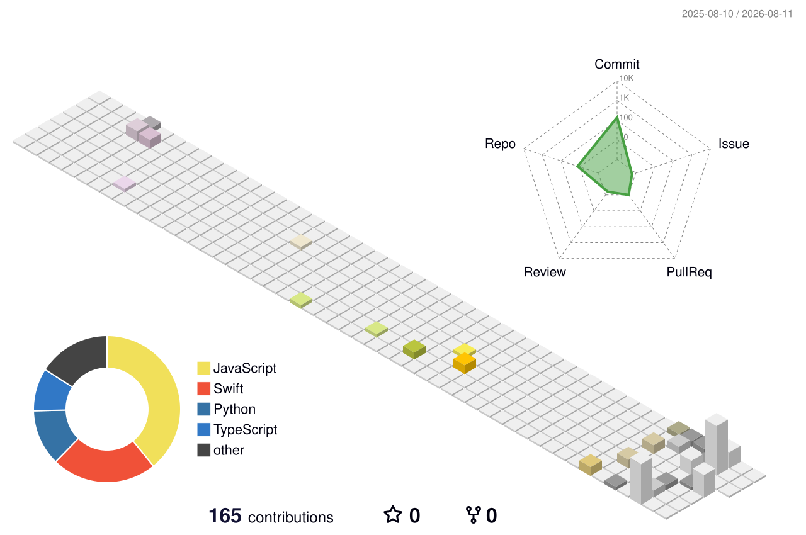

# Hi there 👋 I'm Praful

  

---

## 🛠 Skills & Tech Stack

| Category | Technologies |
|---|---|
| **Mobile** |    |
| **Languages** |     |
| **Frontend** |     |
| **Backend** |   |
| **AI / ML** |    |
| **Cloud & DB** |     |
| **Tools** |    |

---

## 🚀 Featured Projects

### 📱 Compass — AI Journaling App
iOS journaling app with North Star goal tracking, Gemini AI analysis, and handwriting OCR capture.

**Tech:** Swift · SwiftUI · Firebase · Supabase · Gemini AI

---

### 📚 Kanji Learning App
Interactive web application for learning Japanese Kanji and improving language retention.

**Tech:** TypeScript · React

---

### 🌍 AI Travel Planner
Full-stack web application that generates personalized travel itineraries with map visualization.

**Tech:** React · Node.js · Firebase · OpenStreetMap

---

### 🚦 Traffic Prediction System
Machine learning system predicting traffic congestion using LSTM time-series forecasting.

**Tech:** Python · Keras · Pandas · Streamlit

---

## 📊 GitHub Stats

  
  

  

---

## 📊 Coding Profile

• Solved **500+ LeetCode problems**  
• Strong in **Trees, Dynamic Programming, Graphs, Binary Search**

---

⭐ Always exploring new technologies and building projects.

---

## 🕹 Pac-Man Contribution Graph

<picture>
  <source media="(prefers-color-scheme: dark)" srcset="./pacman/pacman-dark.svg" />
  <source media="(prefers-color-scheme: light)" srcset="./pacman/pacman-light.svg" />
  
</picture>

---

## 📈 GitHub Contributions

